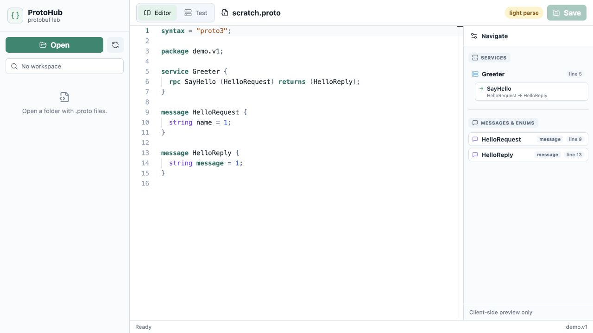
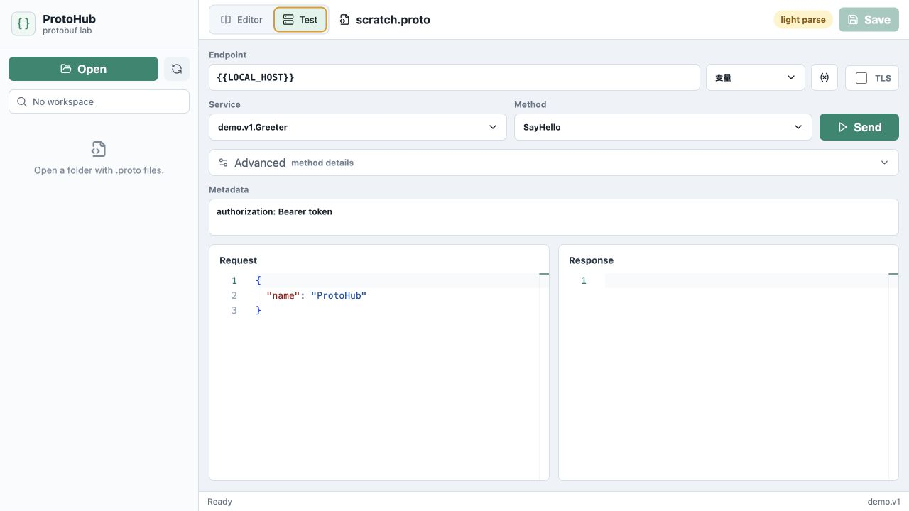
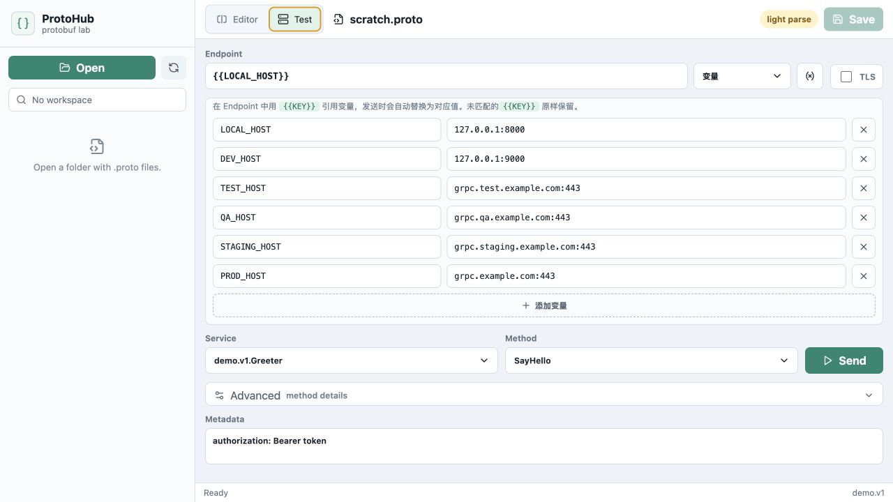

<p align="center">
  
</p>

<h1 align="center">ProtoHub</h1>

<p align="center">
  面向 Protobuf 开发与 gRPC 调试的轻量跨平台桌面工具
</p>

<p align="center">
  <a href="https://github.com/xnzone/protohub/releases/latest"></a>
  <a href="https://github.com/xnzone/protohub/actions/workflows/build.yml"></a>
  
  
</p>

ProtoHub 把 `.proto` 文件浏览、编辑、结构分析和 gRPC 请求测试放进同一个桌面界面。它适合后端开发、接口联调和协议排查，不需要在编辑器、命令行与通用 API 客户端之间频繁切换。

## 界面预览

### Protobuf 编辑与结构导航



Monaco Editor 提供 Protobuf 语法高亮；右侧导航栏同步展示 service、rpc、message 与 enum，可点击快速跳转到定义位置。

### gRPC 请求测试



选择 service 与 method 后即可编辑 endpoint、metadata 和请求 JSON，并在同一界面查看响应。支持 TLS、authority 与完整 method path 等高级选项。

### 多环境地址管理



Endpoint 支持 `{{VARIABLE_NAME}}` 模板。开发、测试、预发与生产环境地址可以保存在本地，发送请求时自动替换。

## 功能亮点

### Protobuf 工作区

- 打开本地目录并浏览其中的 `.proto` 文件
- 使用 Monaco Editor 编辑、保存与语法高亮
- 使用 `Cmd/Ctrl + S` 快速保存
- 解析 import，并支持按住 `Cmd` 点击类型跳转到定义

### 协议结构分析

- 提取 package、service、rpc、message 与 enum
- 展示方法的 request/response 类型及源码行号
- 基于 descriptor 生成请求 JSON 模板和字段树
- descriptor 不可用时自动回退到轻量客户端解析

### gRPC 调试

- 调用普通一元 gRPC 方法
- 编辑 JSON 请求并格式化展示 JSON 响应
- 支持自定义 metadata、TLS、authority 和完整 method path
- 根据 `.proto` descriptor 编码请求并解码响应

### 环境变量

- 使用 `{{LOCAL_HOST}}` 等模板组织 endpoint
- 在发送请求前展示变量解析后的实际地址
- 变量保存在本机，不写入项目的 `.proto` 文件

## 下载与安装

前往 [GitHub Releases](https://github.com/xnzone/protohub/releases/latest) 下载适合当前系统的安装包：

| 系统 | 架构 | 安装包 |
| --- | --- | --- |
| macOS | Apple Silicon（M1/M2/M3/M4 等） | `Apple-Silicon.dmg` |
| macOS | Intel | `Intel-x64.dmg` |
| Windows | x64 | `.exe` 或 `.msi` |
| Linux | x64 | `.AppImage`、`.deb` 或 `.rpm` |

> 当前发布包尚未进行商业代码签名。macOS 或 Windows 首次启动时可能显示来自未知开发者的安全提示，请确认安装包来自本仓库的 Releases 页面。

## 快速上手

1. 启动 ProtoHub，点击左侧 **Open**。
2. 选择包含 `.proto` 文件的工作区。
3. 在文件树中打开协议文件，通过右侧导航查看 service 和 message。
4. 切换到 **Test**，选择需要调用的 service 与 method。
5. 填写 endpoint、metadata 和请求 JSON，然后点击 **Send**。

Endpoint 可以直接填写地址：

```text
127.0.0.1:8000
```

也可以引用环境变量：

```text
{{LOCAL_HOST}}
```

## 当前限制

- 当前仅执行一元 gRPC 调用
- Client streaming、server streaming 与双向流方法可以被识别，但尚不能发送
- 调用依赖本地 `.proto` 文件及其 import，暂不支持 gRPC Server Reflection

## 技术栈

- 前端：React 18、TypeScript、Vite、Monaco Editor、Lucide
- 桌面端：Tauri 2
- Rust：tonic、prost、prost-reflect、protox

## 本地开发

开始前需要准备 Node.js、Rust，以及 [Tauri 2 系统依赖](https://tauri.app/start/prerequisites/)。

安装依赖：

```bash
npm install
```

启动桌面开发模式：

```bash
npm run tauri dev
```

只启动前端：

```bash
npm run dev
```

构建前端资源：

```bash
npm run build
```

构建当前平台的桌面安装包：

```bash
npm run tauri build
```

## 项目结构

```text
.
├── docs/images/             # README 演示图
├── src/                     # React 前端
│   ├── App.tsx              # 编辑器、结构导航和 gRPC 测试界面
│   ├── main.tsx             # 前端入口
│   └── styles.css           # 应用样式
├── src-tauri/               # Tauri/Rust 后端
│   ├── src/lib.rs           # 文件、Protobuf 分析与 gRPC 命令
│   ├── tauri.conf.json      # 桌面应用和安装包配置
│   └── Cargo.toml           # Rust 依赖
├── .github/workflows/       # 多平台安装包发布流程
├── package.json
└── vite.config.ts
```

## 参与开发

欢迎通过 [Issues](https://github.com/xnzone/protohub/issues) 提交问题、使用反馈和功能建议。提交代码前，请先运行：

```bash
npm run build
```
